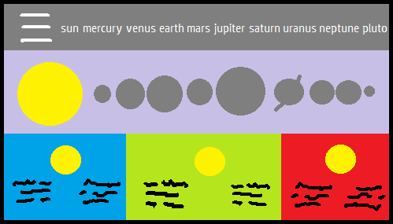
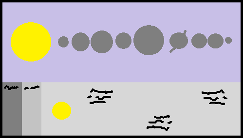
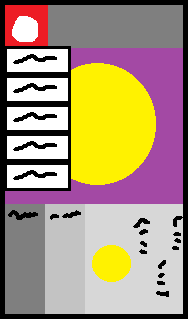
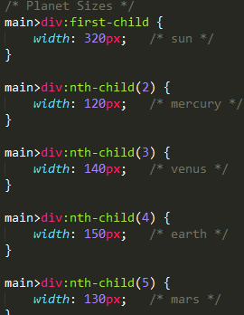
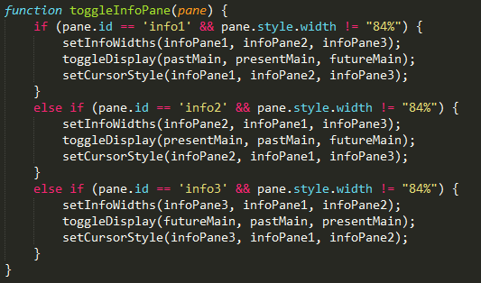
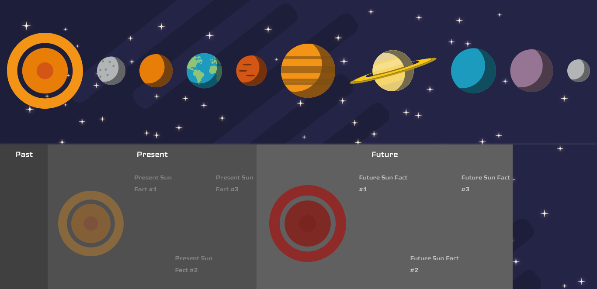

# CTEC3905-Assessment
Repository for the Front End Web Development Assignment

# Draft Design

The first design for the site is similar to the final product but there were changes:

For tablet and desktops the planets would be laid out horizontally in the middle of the screen where the user could click on a planet to change the text at the bottom of the page.

The three sections at the bottom were going to display the information at the same time but part way through development I realised that shortening two of the panels allowed more information to be displayed on the one larger panel. This also allowed me to add a transition affect when selecting panels so the display is less jarring.

It was near the end of the development that I decided the navigation bar was unnecessary when the planets were shown. For smaller screens however, when the planets were to small and wouldn't fit I had the navigation bar appear. For mobile phones the navigation bar was shortened into a dropdown menu so users wouldn't have to try and press on small buttons.

For mobile phones the idea was to display the selected planet in the middle of the screen and allow the user to switch between the content using a dropdown menu. This was the first and only design for it as it worked well when in use. Bigger mobile phones can use the horizontal navigation menu instead of the dropdown.

# Content Used

Flat style planets:
https://www.freepik.com/free-vector/solar-system-planets-collection_1042333.htm
Designed by Frimufilms / Freepik

# Development

The first part of the website I completed was the alignment of the planets. At first it was difficult to get them where I wanted as the images needed to be laid out individually but stay inline with each other even when the screen is resized.

Using a flexbox allowed me to center the images and give space between each planet to make the screen less crowded. To get the planets to resize with the screen, each image was put into a 
 tag and set to a width of 100%. When the divs changed size, the image inside it would to.

Each 
 within the main body was given a different width depending on the size of the planet allowing them to shrink and grow but also stay truer to it's actual size. The sizes given there were a maximum for the images.

The navigation bar was done next and used a flexbox to display each item horizontally. A group of <a> tags were used to show each item and using CSS I changed the background and padding of them to make it look like a banner the stretches across the screen.

The dropdown menu was added later as the horizontal menu didn't work well on a mobile phone (The buttons were too small.) The dropdown menu used nested lists that held the submenus.

At the bottom of the screen I implemented the three information panes by using nested sections holding an image and three facts for each pane. Javascript was used so that when a smaller plane was clicked on it would expand itself and display its information (a CSS transition was used to make this smooth.)

The Javascript would run a function that adjusted the size of the three panes, changed the cursor type and showed/hid the correct information. It would check the id of the clicked pane to decide which pane to expand.

There was an issue with adjusting the panes width. If the user clicks on one pane and then clicks on another mid-transition (as it is moving across the screen,) the latter pane will grow and shrink very quickly but briefly showing the background image. I was not able to find a way to fix this unless the CSS transition was removed entirely, I decided against this as it was jarring to look at when selecting the different panes. I tried to look for a way to stop the eventlistener from running mid-transition but had no success.

